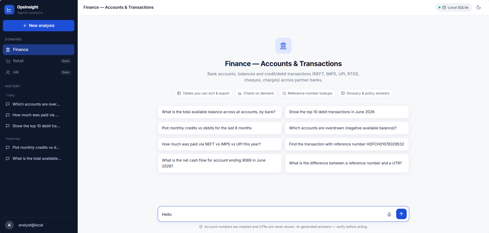
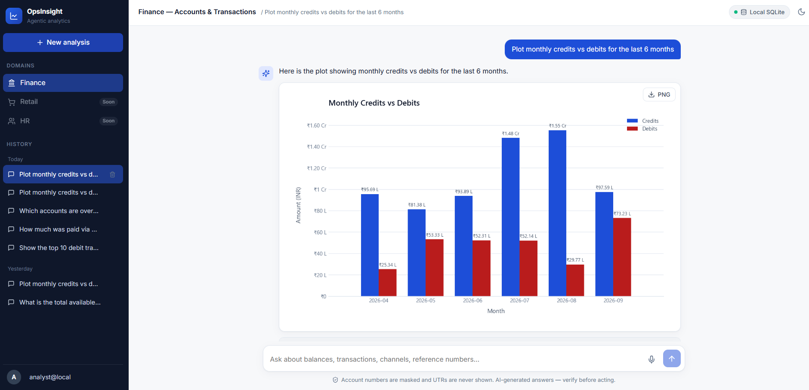
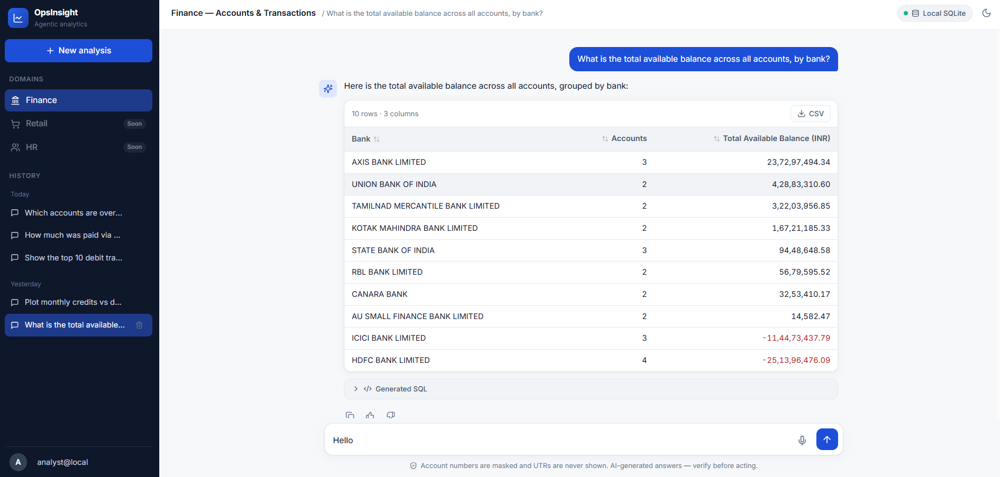

<div align="center">

# OpsInsight

**Agentic analytics chatbot — ask questions about your business data in plain language and get tables, charts and answers.**


[Features](#features) · [Screenshots](#screenshots) · [Quick start](#quick-start) · [Setup options](#setup-options) · [Documentation](#documentation)

<br/>



</div>

---

## Features

- **Natural language → SQL.** Questions are turned into SQL plus Python, run against your warehouse, and returned as tables or charts.
- **Agentic tool routing.** The model chooses between querying data, looking up the business glossary, or answering directly.
- **Finance domain built in.** Covers banks, accounts, balances and credit/debit transactions (NEFT, IMPS, UPI, RTGS, cheques, charges).
- **Privacy guardrails.** Account numbers are masked, UTRs are never shown, and the local data DB is opened read-only.
- **Multi-turn sessions.** Includes history, like/dislike and text feedback.
- **English and Arabic,** plus voice input: speak a question and review the transcript before sending.
- **Pluggable infrastructure.** Runs with SQLite or StarRocks for data, SQLite or MongoDB for sessions, optional Elasticsearch archival and optional Vault.

## Screenshots

<table>
  <tr>
    <td width="50%"></td>
    <td width="50%"></td>
  </tr>
  <tr>
    <td align="center"><b>Charts on demand</b> — "Plot monthly credits vs debits for the last 6 months"</td>
    <td align="center"><b>Sortable, exportable tables</b> — "What is the total available balance by bank?"</td>
  </tr>
</table>

## Quick start

Requirements: **Python 3.12+**, **Node.js 18+**, and a **[Gemini API key](https://aistudio.google.com/app/apikey)**.

```bash
git clone https://github.com/manojmeruva/OpsInsight-Agentic-Chatbot.git
cd OpsInsight-Agentic-Chatbot
```

**1. Backend**

```bash
cd app/src
python -m venv .venv && source .venv/bin/activate   # Windows: .venv\Scripts\activate
pip install -r requirements.txt
cp .env.example .env                                # then set GOOGLE_API_KEY
python main.py                                      # http://127.0.0.1:5000/docs
```

**2. Frontend** (in a new terminal)

```bash
cd frontend
npm install
npm run dev                                         # http://localhost:5001
```

Open http://localhost:5001 and try *"What is the total available balance by bank?"*

## Setup options

`.env.example` defaults to a fully local setup. Pick the data and session stores you want:

### Local database (SQLite) — default

No external services needed. Both databases are included or created automatically.

```env
DATA_DB_ENGINE=sqlite     # queries app/src/finance.db (sample finance data, read-only)
DB_TYPE=sqlite            # chat sessions in app/src/sessions.db (auto-created)
ES_ENABLED=false
```

### MongoDB for sessions

Start MongoDB:

```bash
docker run -d --name opsinsight-mongo -p 27017:27017 mongo:7
```

Then set these in `app/src/.env`:

```env
DB_TYPE=mongo
MONGO_URI=mongodb://localhost:27017
DB_NAME=opsinsight
```

The `sessions` and `session_messages` collections are created on first use.

### StarRocks / MySQL for data (production)

```env
DATA_DB_ENGINE=starrocks
STARROCKS_IP=<host>
STARROCKS_PORT=9030
STARROCKS_USER=<read-only user>
STARROCKS_PASSWORD=<password>
STARROCKS_DB=<database>
```

Load the finance tables with the DDL in [docs/DATA_MODEL.md](docs/DATA_MODEL.md). Optional extras, such as Elasticsearch archival and Vault, are described in [docs/CONFIGURATION.md](docs/CONFIGURATION.md).

## Domains

| Domain | Status |
|---|---|
| Finance — Accounts & Transactions | ✅ Active |
| Retail — Sales & Orders | 🕒 Placeholder |
| HR — Workforce Analytics | 🕒 Placeholder |

To add or activate a domain, see [docs/DEVELOPMENT.md](docs/DEVELOPMENT.md#adding-a-domain).

## Documentation

| Document | Contents |
|---|---|
| [Architecture](docs/ARCHITECTURE.md) | System design, query flow, components, session lifecycle, security, tech stack, project layout |
| [API Reference](docs/API.md) | All REST endpoints with request and response examples |
| [Data Model](docs/DATA_MODEL.md) | Finance schema and ER diagram, session store, Elasticsearch indices, metadata DB |
| [Configuration](docs/CONFIGURATION.md) | Every environment variable for backend and frontend |
| [Deployment](docs/DEPLOYMENT.md) | Docker, frontend build, reverse proxy, StarRocks, Airflow sync |
| [Development](docs/DEVELOPMENT.md) | Tests, manual checks, adding domains, editing prompts |

## Project structure

```
app/src/      FastAPI backend: controllers, core (LLM + tools), prompts, repositories
app/tests/    pytest suite
frontend/     React + TypeScript + Vite UI
docs/         Documentation
Dockerfile    Backend container image
```

## Contributing

1. Fork the repo and create a feature branch.
2. Run the tests: `pytest app/tests`.
3. Open a pull request describing the change.
