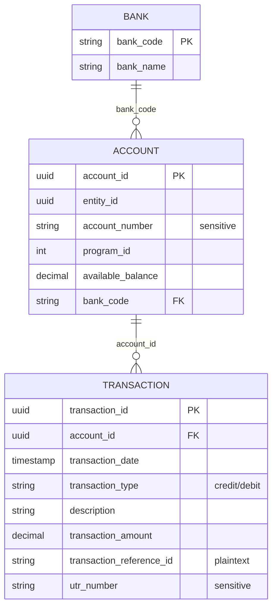

# Data Model

← [Back to README](../README.md)

- [Finance domain](#finance-domain)
- [Domains registry](#domains-registry)
- [Session store](#session-store)
- [Elasticsearch indices](#elasticsearch-indices)
- [metadata.db](#metadatadb)

---

## Finance domain

The data has 3 tables in one database. One bank has many accounts, and one account has many transactions.



### `bank`

| Column | Type | Notes |
|---|---|---|
| `bank_code` | VARCHAR(10) PK | IFSC prefix: `HDFC`, `ICIC`, `SBIN`, `UTIB`, `KKBK`, `CNRB`, `UBIN`, `AUBL`, `TMBL`, `RATN` |
| `bank_name` | VARCHAR(150) | Canonical ALL-CAPS name, e.g. `HDFC BANK LIMITED`. This is a fixed list, so the assistant never invents a bank |

### `account`

| Column | Type | Notes |
|---|---|---|
| `account_id` | VARCHAR(36) PK | UUID |
| `entity_id` | VARCHAR(36) | Owning customer/entity |
| `account_number` | VARCHAR(20) | **Sensitive**. Shown masked to the last 4 digits |
| `program_id` | INT | Product/program (4, 21, 46) |
| `available_balance` | DECIMAL(15,2) | INR. Negative means overdrawn or a drawn credit line |
| `bank_code` | VARCHAR(10) FK | → `bank.bank_code` |

### `transaction`

| Column | Type | Notes |
|---|---|---|
| `transaction_id` | VARCHAR(36) PK | UUID |
| `account_id` | VARCHAR(36) FK | → `account.account_id` |
| `transaction_date` | TIMESTAMP(6) | `YYYY-MM-DD HH:MM:SS.ffffff` |
| `transaction_type` | ENUM | `'credit'` or `'debit'` |
| `description` | VARCHAR(500) | Narration. The payment channel (NEFT/IMPS/UPI/RTGS/FT/cheque/charges) is derived from it |
| `transaction_amount` | DECIMAL(15,2) | Always positive |
| `transaction_reference_id` | VARCHAR(64) | **Plaintext**. A bare "reference number" question searches this column |
| `utr_number` | VARCHAR(256) | **Sensitive / encrypted**. Never displayed and never matched with `WHERE =` |

`transaction` is a reserved word, so generated SQL always quotes it with backticks. Backticks are valid in both MySQL and SQLite.

### Local dataset — `app/src/finance.db`

| Table | Rows | Contents |
|---|---|---|
| `bank` | 10 | All partner banks |
| `account` | 25 | 10 reference samples + 15 synthetic |
| `transaction` | 1,410 | 10 reference samples + synthetic history, Oct 2025 – Sep 2026 |

The synthetic rows follow the production narration and reference formats. They are for demos and testing only.

## Domains registry

Declared in `Config.DOMAINS` (`app/src/config.py`) and served by `GET /api/modules`.

| Module | Tag | Status | Prompt | RAG context |
|---|---|---|---|---|
| `FINANCE` | `finance` | active | `prompts/finance.md` | `core/finance_operations.txt` |
| `RETAIL` | `retail_sales` | placeholder | — | — |
| `HR` | `hr_workforce` | placeholder | — | — |

Placeholder domains appear in the UI as "Soon". The assistant replies that they are coming soon and calls no tools. To activate one, see [DEVELOPMENT.md](DEVELOPMENT.md#adding-a-domain).

## Session store

MongoDB collections (`DB_TYPE=mongo`) or SQLite tables in `sessions.db` (`DB_TYPE=sqlite`, stored as JSON documents) have the same shape.

**`sessions`**

| Field | Type | Description |
|---|---|---|
| `session_id` | string | Client-generated ID |
| `user_email` | string | Owner |
| `session_name` | string | First question |
| `module_name` | string | e.g. `FINANCE` |
| `avg_response_time`, `query_exec_time` | float | Metrics |
| `created_at`, `last_updated` | datetime | Timestamps |
| `chat_history` | array | Serialized LangChain messages (used to restore a session) |

**`session_messages`**

| Field | Type | Description |
|---|---|---|
| `session_id`, `message_id`, `response_id` | string | IDs (`response_id` is server-generated) |
| `user_input`, `translated_input` | string | Question and its English translation |
| `response` | array | `[{type, content, mime_type?}]` |
| `sql` | string | Generated SQL |
| `execution_times` | array | Nested timing tree |
| `input_timestamp`, `timestamp` | string / datetime | Client and server time |
| `response_time` | float | Seconds |
| `error_message` | string | Traceback (never shown to users) |
| `like`, `feedback` | bool / string | User feedback |

## Elasticsearch indices

| Index | `_id` | Notes |
|---|---|---|
| `interact_sessions` | `session_id` | `chat_history` is stored but not indexed |
| `interact_session_messages` | `response_id` | `response` and `execution_times` are stored but not indexed |

## metadata.db

A single table holds the pre-built domain prompts:

```sql
CREATE TABLE prompts (
    id          INTEGER PRIMARY KEY AUTOINCREMENT,
    tag         TEXT NOT NULL UNIQUE,
    prompt      TEXT NOT NULL,
    description TEXT,
    module      TEXT
);
```
